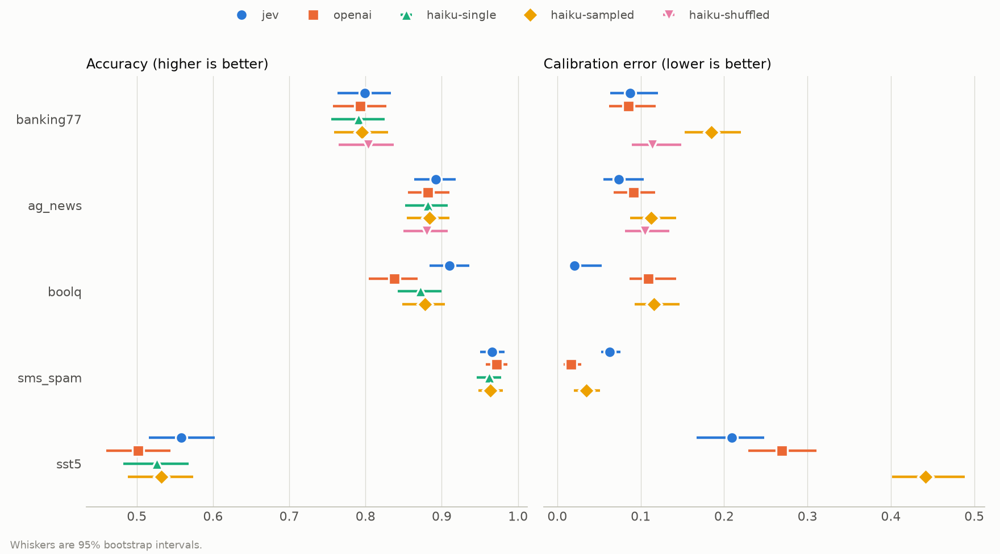

# haiku-decides

Claude Haiku 5.5 as a decision model, benchmarked head-to-head against Jev and
the OpenAI Decisions API.

Decision models answer a closed question about some input and return a typed
answer with a probability for every option. TypeSafe AI's Jev does this
natively, and so does OpenAI's Decisions API. Anthropic has no decision API.
`haiku-decides` emulates the same interface on top of Claude Haiku 5.5 in three
ways and measures how close each one gets.

## Results

First full run, 8 October 2026. Full numbers with intervals are in
[results/scorecard.md](results/scorecard.md); the raw decisions are in
[results/](results).



**Accuracy** (500 items per dataset)

| Dataset | Jev | OpenAI Decisions | Haiku single | Haiku sampled | Haiku shuffled |
|---|---|---|---|---|---|
| Banking77 (77 options) | 79.9% | 79.3% | 79.1% | 79.5% | 80.3% |
| AG News (4 options) | 89.2% | 88.2% | 88.2% | 88.4% | 88.0% |
| BoolQ (yes/no) | 91.0% | 83.8% | 87.2% | 87.8% | n/a |
| SMS Spam (yes/no) | 96.6% | 97.2% | 96.2% | 96.4% | n/a |
| SST-5 (5 levels) | 55.8% | 50.2% | 52.6% | 53.2% | n/a |

**Calibration error** (ECE, lower is better)

| Dataset | Jev | OpenAI Decisions | Haiku sampled | Haiku shuffled |
|---|---|---|---|---|
| Banking77 | 0.088 | 0.085 | 0.185 | 0.114 |
| AG News | 0.074 | 0.092 | 0.112 | 0.105 |
| BoolQ | 0.021 | 0.109 | 0.116 | n/a |
| SMS Spam | 0.063 | 0.016 | 0.035 | n/a |
| SST-5 | 0.209 | 0.269 | 0.441 | n/a |

**Speed and cost** (range across the five datasets)

| | Jev | OpenAI Decisions | Haiku single | Haiku sampled | Haiku shuffled |
|---|---|---|---|---|---|
| Median latency | 261-278 ms | 139-252 ms | 813-1228 ms | 876-2323 ms | 1217-1360 ms |
| Cost per 1,000 decisions | $0.014-0.071 | $0.016-0.099 | $0.040-0.054 | $0.40-0.54 | $0.54-2.11 |

What the run shows:

- **One Haiku 5.5 call is as accurate as the native decision APIs on four of
  the five datasets.** The paired difference from Jev and from OpenAI Decisions
  is not distinguishable from zero on Banking77, AG News, SMS Spam and SST-5.
  On BoolQ, Jev is ahead of Haiku (91.0% against 87.2%), and sampled Haiku is
  ahead of OpenAI Decisions (87.8% against 83.8%).
- **Sampling ten times buys probabilities, not accuracy.** The sampled mode
  matches the single call on every dataset and costs eight to ten times as much.
- **Those probabilities are less well calibrated than the native ones.** Sampled
  Haiku has the highest calibration error on four of the five datasets, though
  on BoolQ it is level with OpenAI Decisions. SMS Spam is the exception, where
  it sits between the two native APIs. Shuffling the option order brings Banking77 from
  0.185 down to 0.114, at five times the cost of plain sampling.
- **The native APIs are three to nine times faster.** Their median is 140 to
  280 ms; a single Haiku call takes 0.8 to 1.2 seconds with thinking off.
- **A single Haiku call is not the expensive option.** On Banking77 it was the
  cheapest of the three, because the 77-option question repeats and 97% of its
  input came from the prompt cache.
- **Order sensitivity differs a lot on the 77-option task.** Across five
  reorderings of the options, the answer changed for 4% of items with Jev, 30%
  with OpenAI Decisions, 22% with a single Haiku call and 8% with shuffled
  Haiku. The same-order baseline was 2% or less. This comes from 50 items per
  dataset, so treat it as a first reading. On AG News every system stayed at 4%
  or below.

This run used 500 items per dataset for accuracy and calibration, 50 items
times 5 reorderings for order sensitivity (the two choice datasets), and 50
items per dataset for latency. The order and latency samples are smaller than
the tool's defaults (200 and 100) to keep API spend down. Latency was measured
from a single client machine in Aachen, Germany.

## How it works

All three systems receive the same question in the same shape: a `state` to
judge and a question of type `choice`, `noul` (yes/no), or `score`.

Jev and the OpenAI Decisions API are called as they are. Claude Haiku 5.5 runs
with thinking disabled and an enum-constrained structured output, in three
modes:

| Mode | How it runs | What it shows |
|---|---|---|
| `single` | One call | What most people do today. No probabilities. |
| `sampled` | The same request N times in parallel; vote shares become probabilities | Whether you can get probabilities without logprobs |
| `shuffled` | N calls, each listing the options in a different order | What changes once order bias is averaged out |

Claude Haiku 5.5 only accepts a temperature of 1, so N samples are honest draws
from the model's own answer distribution.

Four things are measured:

- **Accuracy** against the dataset's label.
- **Calibration**: when a system says 80%, is it right 80% of the time?
  Reported as expected calibration error (10 bins) and Brier score.
- **Order sensitivity**: how often the answer flips, and how far the
  probabilities move, across five different orderings of the same options. A
  "repeat flip" column shows how often the answer changes between two runs with
  the same order, so you can see how much of a flip rate is plain sampling noise.
- **Latency and cost**: p50 and p95 per decision, and dollars per 1,000
  decisions.

Accuracy and calibration come with 95% bootstrap intervals. Accuracy verdicts
test the paired difference on the items every system answered, and say "not
distinguishable" when that difference could be zero. Brier is the multiclass
form: 0 is perfect, 2 is worst.

## Reproduce

```bash
python -m venv .venv
.venv/bin/pip install -e ".[dev]"
cp .env.example .env
```

Fill in `.env` with your keys, then:

```bash
.venv/bin/haiku-decides select-ids
.venv/bin/haiku-decides run
.venv/bin/haiku-decides report --location "your city"
```

`run` appends one JSON line per decision under `results/` and resumes where it
stopped if you interrupt it. To try it on a few items first, add
`--limit 5 --results results-dry`.

The tests need no keys and no network:

```bash
.venv/bin/python -m pytest -q
```

## Datasets

500 items from each, chosen with a fixed seed. The chosen row indices are in
`data/ids/`.

| Dataset | Hugging Face id | Question type | Declared license |
|---|---|---|---|
| Banking77 | `legacy-datasets/banking77` | choice, 77 options | cc-by-4.0 |
| AG News | `fancyzhx/ag_news` | choice, 4 options | unknown |
| BoolQ | `google/boolq` | yes/no | cc-by-sa-3.0 |
| SMS Spam | `ucirvine/sms_spam` | yes/no | unknown |
| SST-5 | `SetFit/sst5` | score, 5 levels | not stated |

This repository ships row indices and model outputs only, never dataset text.
The text is downloaded from Hugging Face when you run the benchmark.

## Limitations

- These datasets are very likely in the training data of every model tested.
- With N=10, probabilities come in steps of 0.1, so the calibration numbers for
  the sampled modes are coarse.
- Latency is measured from one location.
- Claude Haiku 5.5 is not deterministic: the same input can produce a different
  decision.
- Only the option list in the prompt is reordered. The enum in the output schema
  stays sorted, so order sensitivity for Claude Haiku 5.5 measures the prompt
  alone.
- The OpenAI Decisions API is in public beta and may change.
- The latency pass re-sends questions the main pass already asked. If a provider
  caches responses, its latency here is flattering.
- Cost is per answered decision at list prices, with whatever prompt caching
  each run happened to get.
- `report` reads each dataset from the local Hugging Face cache to get the
  labels, so it needs the datasets to have been downloaded once (`select-ids`
  does that). Dataset revisions are pinned.

## License

MIT. See [LICENSE](LICENSE).

Not affiliated with Anthropic, OpenAI or TypeSafe AI.
